# Baraka Homes

> A role-aware rental operations platform for Kenyan property teams — homes, leases, payments, maintenance, and portfolio decisions in one mobile workspace.

Baraka Homes is an Expo and React Native application for rental management in Kenya. Tenants can pay rent and report repairs; agents manage homes and operations; caretakers see assigned onsite work only; owners follow collections, approvals, payouts, communication, and reports.

## Screenshots

### Owner portfolio

| Portfolio overview | Agent collection performance |
| --- | --- |
| 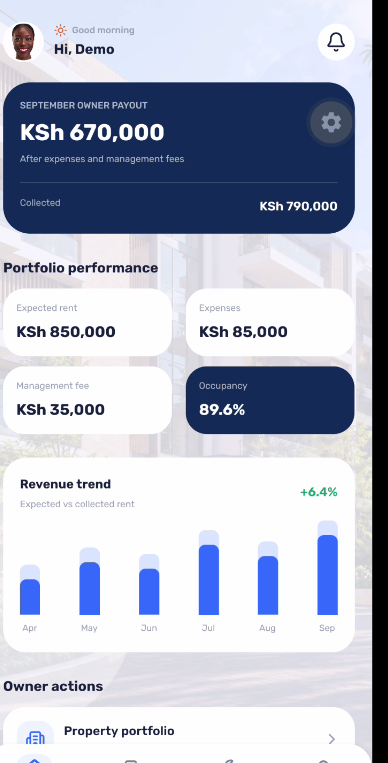 | 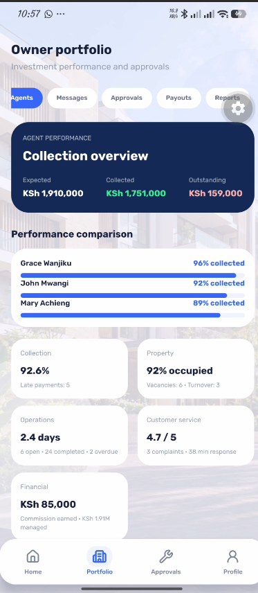 |

| Approval centre | Owner communication |
| --- | --- |
| 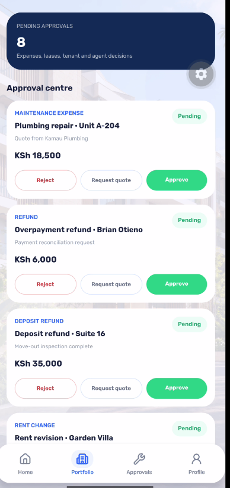 | 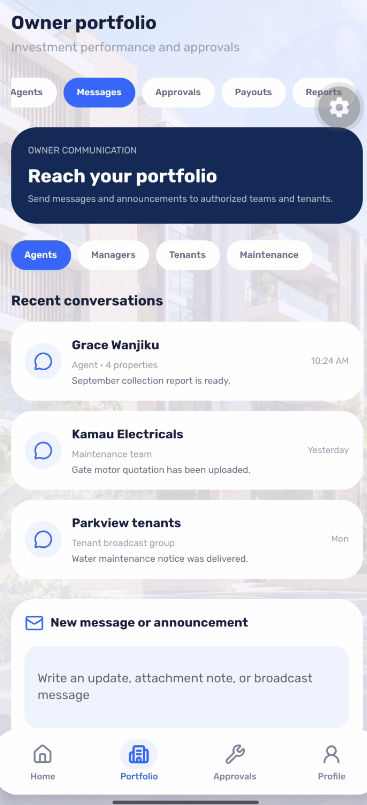 |

| Payout history | Reporting centre |
| --- | --- |
| 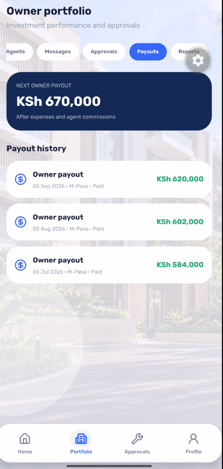 | 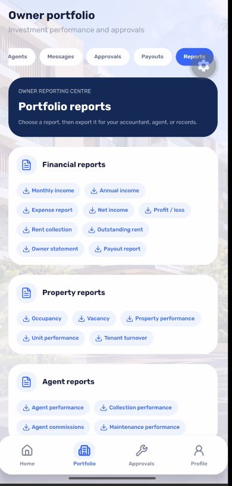 |

### Tenant and agent workspaces

| Welcome | Tenant profile | Tenant maintenance |
| --- | --- | --- |
| 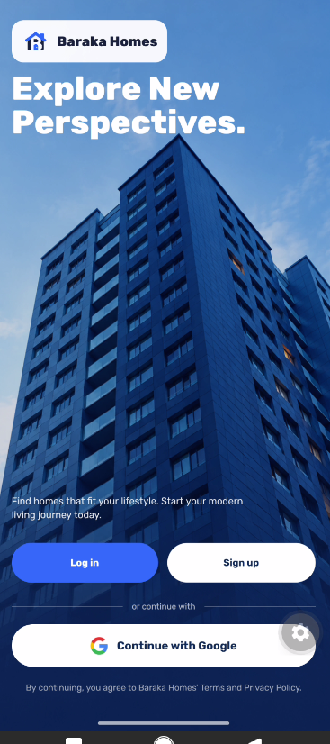 | 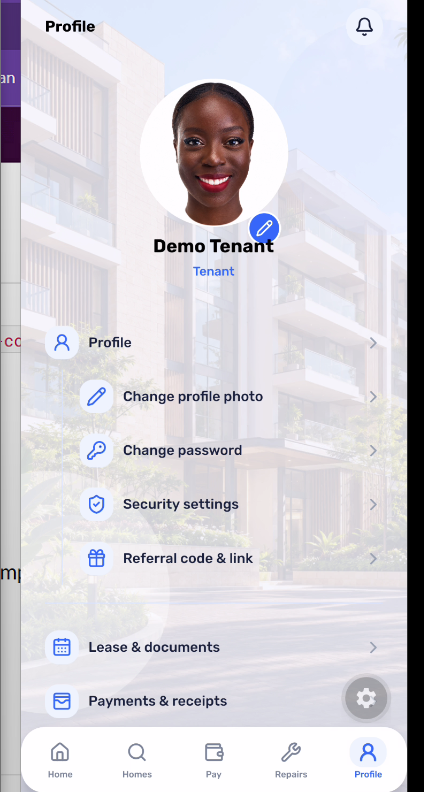 | 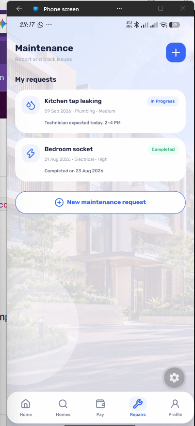 |

| Agent workspace | Agent maintenance queue | Agent profile |
| --- | --- | --- |
| 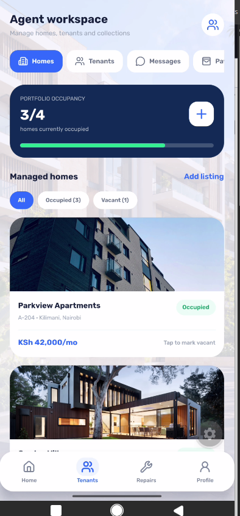 | 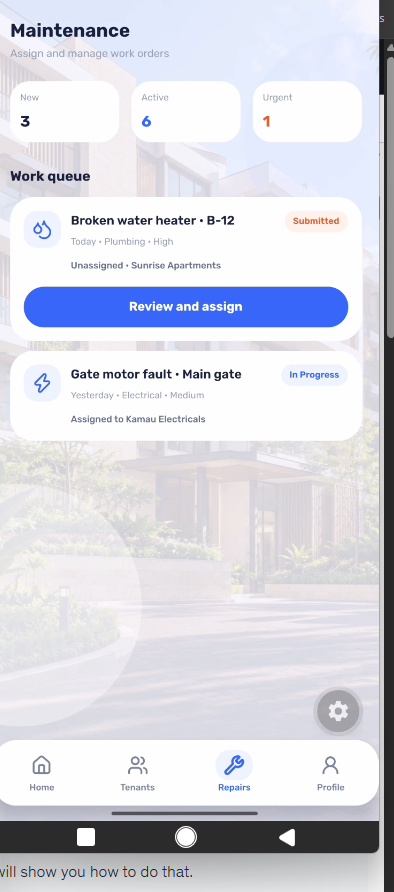 | 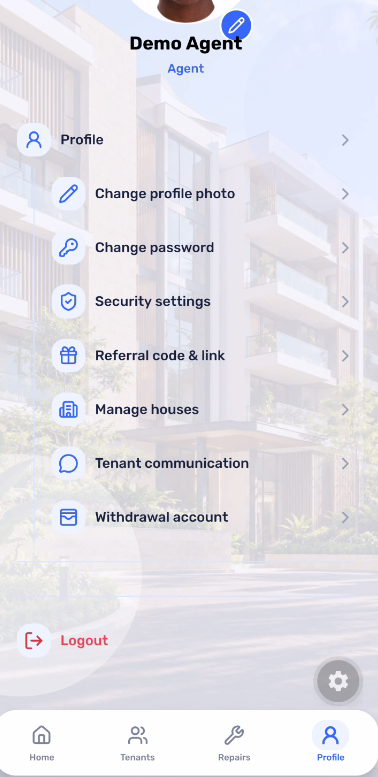 |

## Features

### Role-aware workspaces

- **Tenant:** browse homes, review lease information, pay rent and utilities, access receipts, report maintenance, and manage account security.
- **Agent:** manage homes and units, track occupancy, communicate with tenants, coordinate caretakers, and review collections.
- **Caretaker:** receives only assigned property tasks; rent, balances, and owner finance remain restricted.
- **Owner:** follows portfolio performance, approvals, documents, messages, payouts, and report categories.

### Property, finance, and operations

- Apartments, houses, shops, and BNB listings with pricing, photos, and amenities.
- Unit lifecycle: available, reserved, occupied, and maintenance.
- Linked lease, invoice, payment, and ledger records.
- Maintenance workflow from tenant report to agent assignment and caretaker execution.
- Notifications, audit events, owner approval flows, and report categories.
- PayHero M-Pesa STK Push integration boundary with idempotent payment reconciliation.

### Security

- Appwrite email/password authentication plus tenant Google sign-in.
- Profile photos, password updates, security preferences, and login alerts.
- Row-level caretaker access for assigned work only.
- Payment provider credentials stay in Appwrite Function variables, never the mobile app.

## Tech stack

| Area | Technology |
| --- | --- |
| Mobile | Expo, React Native, Expo Router |
| UI | TypeScript, NativeWind, Lucide React Native |
| Backend | Appwrite Auth, TablesDB, Storage, Functions |
| Payments | PayHero M-Pesa STK Push via Appwrite Function |
| Documents | Expo Print and Expo Sharing, ready for PDF statements |
| Quality | TypeScript compiler, Jest/Expo tooling |

## Installation and local development

### Prerequisites

- Node.js 20+
- npm
- An [Appwrite](https://appwrite.io/) Cloud project
- Expo Go or an Expo development build

### 1. Clone and install

```bash
git clone <your-repository-url>
cd baraka-homes
npm install
```

### 2. Configure environment variables

Create `.env` from the example file.

```powershell
Copy-Item .env.example .env
```

```bash
cp .env.example .env
```

Fill in the mobile-safe variables:

```env
EXPO_PUBLIC_APPWRITE_ENDPOINT="https://fra.cloud.appwrite.io/v1"
EXPO_PUBLIC_APPWRITE_PROJECT_ID="your-project-id"
EXPO_PUBLIC_APPWRITE_DATABASE_ID="your-database-id"
EXPO_PUBLIC_APPWRITE_USER_PROFILES_COLLECTION_ID="user_profiles"
EXPO_PUBLIC_APPWRITE_PROPERTIES_COLLECTION_ID="your-properties-table-id"
EXPO_PUBLIC_APPWRITE_BUCKET_ID="your-storage-bucket-id"
EXPO_PUBLIC_APPWRITE_CARETAKER_TASKS_TABLE_ID="caretaker_tasks"
EXPO_PUBLIC_APPWRITE_PAYHERO_FUNCTION_ID="payhero-payments"
```

`APPWRITE_API_KEY` and `PAYHERO_*` variables are server secrets. Never add `EXPO_PUBLIC_` to them, commit them, or include them in the mobile bundle. Configure PayHero credentials as encrypted Appwrite Function variables.

### 3. Seed development accounts

Create an Appwrite API key with user-management permission, place it in `.env` as `APPWRITE_API_KEY`, then run:

```bash
npm run seed:users
```

| Role | Email | Password |
| --- | --- | --- |
| Tenant | `tenant@barakahomes.test` | `Tenant@123` |
| Agent | `agent@barakahomes.test` | `Agent@123` |
| Owner | `owner@barakahomes.test` | `Owner@123` |
| Caretaker | `caretaker@barakahomes.test` | `Caretaker@123` |

These credentials are development-only. Rotate or remove them before production.

### 4. Run and validate

```bash
npm run start
```

The default development server uses port `8081`. For web:

```bash
npm run web
```

Validate TypeScript:

```bash
npx tsc --noEmit
```

## Usage overview

1. Sign in as a tenant through Google or a seeded email/password account.
2. View a home, submit a repair, or initiate a rent payment.
3. Sign in as an agent to manage units, occupancy, and onsite work.
4. Sign in as a caretaker to view only assigned tasks.
5. Sign in as an owner to review performance, approvals, messages, payouts, and reports.

### PayHero function

The Appwrite Function in `functions/payhero` exposes:

- `POST /payments/initiate` — authenticated tenant STK Push.
- `POST /payments/callback?token=...` — protected PayHero callback.
- `GET /health` — safe credential configuration check.

Deploy it on Node.js 22 with entrypoint `src/main.js`, restrict execution to authenticated users, and store provider credentials as encrypted function variables. Callback handling must reconcile payments idempotently and record ledger/audit entries.

## Contributing

1. Create a focused branch: `git checkout -b feat/short-description`
2. Keep changes accessible, role-safe, and focused.
3. Run `npx tsc --noEmit` before opening a pull request.
4. Describe the affected role, workflow, authorization rule, and test coverage.
5. Never commit keys, payment credentials, private tenant data, or production data.

## License

Distributed under the [MIT License](LICENSE). Copyright © 2026 Mavine.
